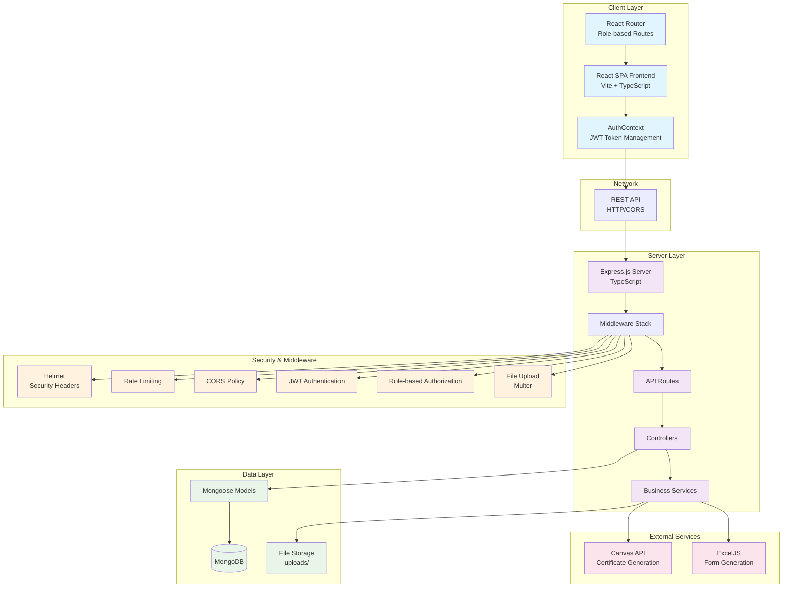
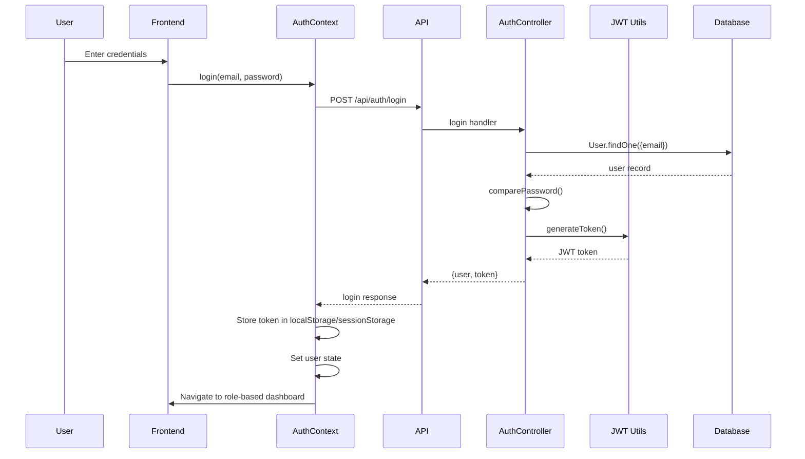
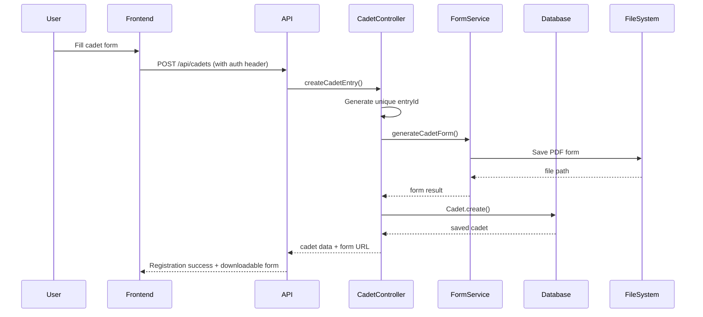

# Taekwondo Association Management System - Architecture

## System Overview

This is a full-stack web application for managing Taekwondo association operations including cadet registrations, Poomsae competitions, certificate generation, and administrative dashboards with role-based access control.

## Architecture Diagram



## Data Flow

### Authentication Flow


### Cadet Registration Flow


## Technology Stack

### Backend
- **Runtime**: Node.js with TypeScript
- **Framework**: Express.js
- **Database**: MongoDB with Mongoose ODM
- **Authentication**: JWT (jsonwebtoken)
- **Security**: 
  - Helmet (security headers)
  - express-rate-limit (DDoS protection)
  - bcryptjs (password hashing)
  - CORS policy
- **File Processing**: 
  - @napi-rs/canvas (certificate generation)
  - ExcelJS (form generation)
  - multer (file uploads)
- **Validation**: Zod schemas
- **Development**: nodemon, ts-node

### Frontend
- **Framework**: React 18 with TypeScript
- **Build Tool**: Vite
- **Routing**: React Router DOM v7
- **HTTP Client**: Axios
- **State Management**: React Context (AuthContext)
- **Styling**: CSS (based on file structure)

### Database Schema
- **Users**: email, password (hashed), name, role, state, district, isActive
- **Cadets**: entryId, name, DOB, age, weight, gender, state, district, TFI ID, form file
- **Poomsae**: Similar structure for Poomsae competitions
- **Certificates**: serial, name, medal, category, generated file paths
- **Counters**: Atomic sequence generation for unique IDs

## Security Architecture

### Authentication & Authorization
1. **JWT-based Authentication**:
   - 7-day token expiration
   - Bearer token in Authorization header
   - Token stored in localStorage (remember me) or sessionStorage

2. **Role-based Access Control (RBAC)**:
   - `superAdmin`: Full system access
   - `stateAdmin`: State-level management
   - `districtAdmin`: District-level management
   - Route-level role enforcement

3. **Security Measures**:
   - Password hashing with bcrypt (salt rounds: 10)
   - Rate limiting (100 requests/15 minutes)
   - CORS policy with environment-based origins
   - Helmet security headers
   - Input validation with Zod schemas

### Data Access Patterns
- **District Admins**: Can only access their own district's data
- **State Admins**: Can access all districts within their state
- **Super Admins**: Full system access
- Filters applied at controller level before database queries

## File Structure & Patterns

### Backend Architecture
```
backend/src/
├── server.ts              # Express app entry point
├── config/
│   └── database.ts        # MongoDB connection & retry logic
├── middleware/
│   ├── authMiddleware.ts  # JWT verification & role checks
│   ├── errorMiddleware.ts # Global error handling
│   ├── uploadMiddleware.ts # File upload handling
│   └── validationMiddleware.ts # Zod schema validation
├── models/               # Mongoose schemas
├── controllers/          # Route handlers with business logic
├── routes/              # Express route definitions
├── services/            # Business logic & external integrations
├── utils/               # Utility functions (JWT, file monitoring)
└── types/               # TypeScript type definitions
```

### Frontend Architecture
```
frontend/
├── App.tsx                    # Main app with router setup
├── src/
│   ├── components/           # Reusable UI components
│   ├── contexts/
│   │   └── AuthContext.tsx   # Authentication state management
│   ├── layouts/              # Page layouts (Main, Dashboard)
│   └── types/                # TypeScript interfaces
├── pages/                    # Page components
│   └── dashboards/           # Role-specific dashboard pages
└── services/
    └── api.ts                # Axios HTTP client with interceptors
```

## Development Patterns

### Error Handling
- Custom error classes (`ValidationError`, `AuthenticationError`, `AuthorizationError`)
- Global error middleware with structured JSON responses
- Frontend axios interceptors with development logging

### Code Organization
- TypeScript throughout for type safety
- Separation of concerns (routes → controllers → services → models)
- Middleware composition for cross-cutting concerns
- Custom TypeScript types for API contracts

### Development Workflow
- Hot reload with nodemon (backend) and Vite (frontend)
- Environment-based configuration
- Comprehensive logging in development mode
- Health check endpoint for system monitoring

## Deployment Considerations

### Environment Variables
- `MONGODB_URI`: Database connection string
- `JWT_SECRET`: Token signing secret (critical for security)
- `CORS_ORIGIN`: Allowed frontend origins
- `PORT`: Server port (default: 5000)
- `NODE_ENV`: Environment mode
- `RATE_LIMIT_*`: Rate limiting configuration

### Production Readiness
- File uploads stored locally (consider cloud storage for scale)
- MongoDB connection pooling and retry logic
- Rate limiting and security headers configured
- Health check endpoint for load balancer integration
- Error logging and monitoring hooks in place

## API Endpoints Summary

### Authentication (`/api/auth`)
- `POST /login` - User login
- `GET /profile` - Get current user profile
- `GET /users` - List users (superAdmin only)
- `POST /users` - Create user (superAdmin only)
- User management endpoints with role-based access

### Cadets (`/api/cadets`)
- `POST /` - Create cadet entry (generates PDF form)
- `GET /` - List cadet entries (filtered by user role)
- `GET /:entryId` - Get specific cadet
- `DELETE /:entryId` - Delete cadet entry
- `GET /stats` - Get statistics (filtered by user role)

### Similar patterns for Certificates, Poomsae, Dashboard, and Export endpoints

This architecture supports a scalable, secure, multi-tenant system with clear separation of concerns and comprehensive role-based access control.